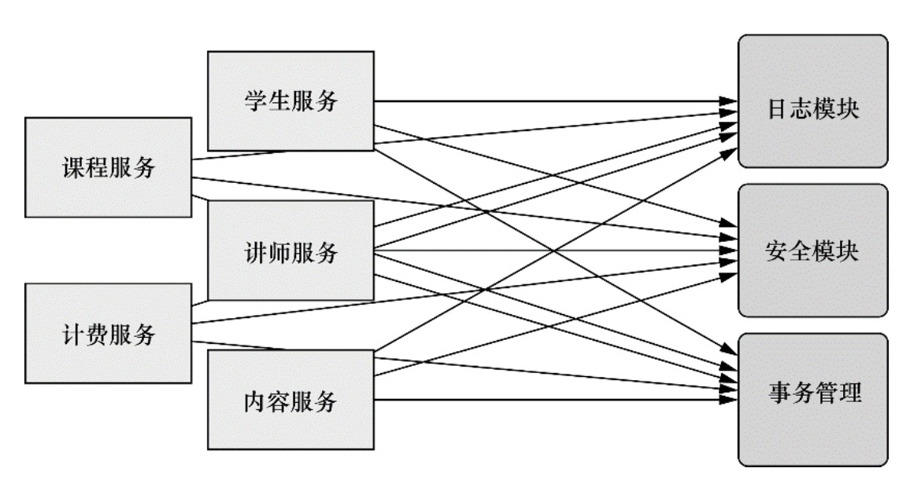
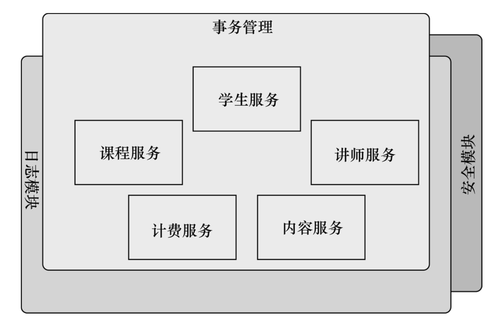
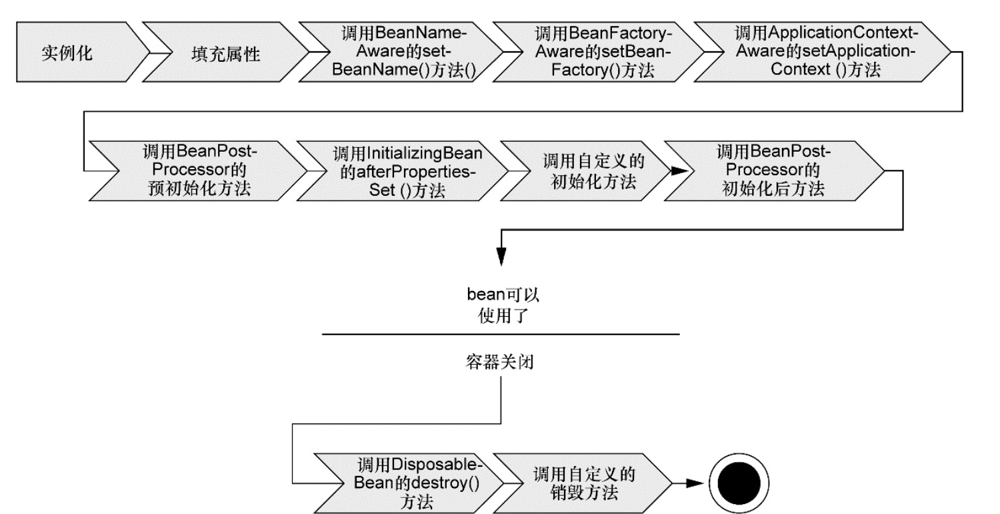
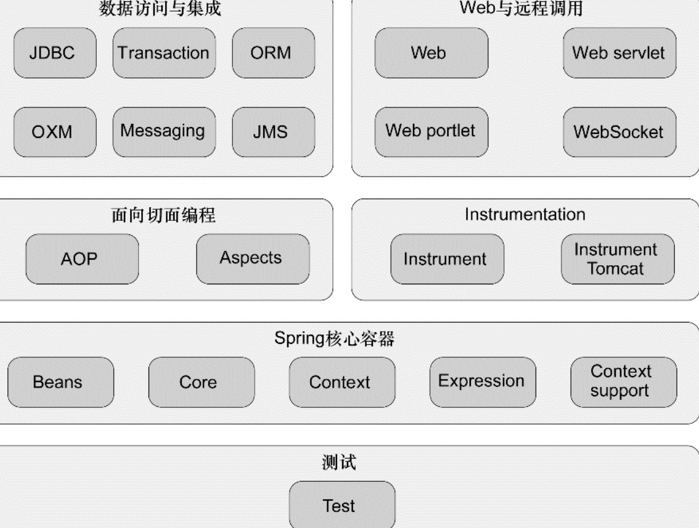

## Spring 介绍


<p>在诞生之初,创建Spring的主要目的是用来替代更加重量级的企业级Java技术,尤其是EJB。相对于EJB来说,Spring提供了更加轻量级和简单的编程模型。</p>

Spring和Struts的区别
```
Struts关注的是如何快速开发web应用，它是一个MVC框架，它的重点在C（Controller)和V(View)Sturts提供了一些列定制的标签，Struts几乎没有设计到Model

Spring是一个轻量级的容器，他的核心是BeanFactory，用来管理Model，各种应用组件。他的宗旨是简化JAVA开发，它可以用在任何的JAVA应用中。
所两者是完全不同的2个东西哈，他们的理念和关注点都是不一样的，而且随着现在的前后端分离，Struts已经基本消失了，只有很老的项目再用。

```
<p>Spring可以做很多事情,但是归根结底它所有的理念都追溯到Spring的最根本使命：简化JAVA开发。</p>
<p>
它提供的所有的功能底层都依赖于它的两个核心特性,也就是依赖注入(dependencyinjection,DI)和面切面编程(aspct-orientedprogramming,AOP)。</p>


Spring的目标是全方位的降低JAVA开发的复杂性，主要采用四个策略：
```
基于POJO(Plain Ordinary Java Object简单java对象)的轻量级和最小侵入性编程;
通过依赖注入和面向接口实现松耦合;
基于切面和惯例进行声明式编程;
通过切面和模板减少样板式代码（这块体现最明显的就是Spring的JDBC但是生产中一般都使用其他的ORM框架替代Spring的JDBC）。
```
###  基于POJO的轻量级和最小侵入性编程
我们假设现在有一个小探险程序，骑士可以执行探险任务。
我们先实现2个POJO表示探险任务和骑士代码如下：
```
public class RescueGirlQuest {
	
	public void embark(){
		
		System.out.println("拯救女孩");
	}
}

//* 叼丝版本的骑士只能能做拯救女孩的探险。
public class DiaosiKnight{
    //拯救女孩的探险任务
	private RescueGirlQuest quest;
	public  DiaosiKnight() {
		quest = new RescueGirlQuest();
	}
	public void embarkOnQuest() {
		quest.embark();
	}
}

```
这种实现乍一看没问题哈，那么假如我们扩展一下，我想让骑士干点别的探险怎么办？这种实现是一种高度耦合的实现，组件之间耦合度太高。我们改进一下实现策略采用面向接口编程：

```
public class RescueGirlQuest implements Quest{
	
	public void embark(){
		
		System.out.println("拯救女孩");
	}
}
public class RegularKnight implements Knight{
	//接口
	private Quest quest; 
	
	/*
	 * 这里通过构造方法注入进来的探险任务，骑士就可以去做
	 * 这里的关键点就是正经骑士没有和任意的具体探险任务耦合，对它来说他不关心具体的任务是什么，只要是安排给我就好了。
	 * 这样是面向接口编程的一个好处，用接口表明依赖关系，你后台完全可以用不同的实现方式进行替换，而调用方完全不知道，也不关心。
	 */
	public RegularKnight(Quest quest){
		this.quest = quest;
	}
	
	public void embarkOnQuest() {
		this.quest.embark();		
	}
}
```
到这一步我们还没有发现spring能为我们做什么呢，我们让这个程序跑起来，看看让骑士执行任务的入口的代码：
```

// 我们现在看一下在不使用spring的情况下需要如何让骑士去干活
Quest quest = (Quest) new RescueGirlQuest();
RegularKnight knight = new RegularKnight(quest);
knight.embarkOnQuest();

```
乍一看并没有什么问题哈，但是这里还是有明确的依赖声明，我们需要先new一个探险任务，再new一个骑士，然后让骑士去干活。现在我们引入Spring。<br>
先介绍一个名词-装配：创建应用组件之间的协作行为叫做装配.上边这种就是一种装配，给骑士安排一个探险任务处理他们的依赖关系。Spring有多种装配方式，这里介绍一下xml形式的装配方式，我们需要引入一个叫做beans.xml（这个文件名字可以随便定义）的文件，在工程根目录：
它内容如下：
```
<?xml version="1.0" encoding="UTF-8"?>
<beans xmlns="http://www.springframework.org/schema/beans"
    xmlns:xsi="http://www.w3.org/2001/XMLSchema-instance"
     xmlns:aop="http://www.springframework.org/schema/aop"     
    xsi:schemaLocation="http://www.springframework.org/schema/beans
    http://www.springframework.org/schema/beans/spring-beans-3.0.xsd
    	http://www.springframework.org/schema/aop http://www.springframework.org/schema/aop/spring-aop-4.0.xsd">
	<!--  声明beans,可以看到从bean的的各个定义中就可以看到各个组件的依赖关系-->
   <bean id="quest" class="com.baofeng.RescueGirlQuest"></bean>

  <bean id="knight" class="com.baofeng.RegularKnight">
       <!-- 构造函数注入方式 -->
       <constructor-arg ref="quest"></constructor-arg>
       
   </bean>

</beans>
```
在这里RegularKnight和RescueGirlQuest被声明称Bean，他们的依赖关系一目了然。这个时候我们再看一下程序的入口：

```
//读取配置文件
ApplicationContext context = new ClassPathXmlApplicationContext("beans.xml"); 
//获取knight bean
Knight knight1 = (Knight) context.getBean("knight");
knight1.embarkOnQuest();
```
是不是觉得清净了一下子，这个时候可能会觉得好像引入spring更复杂了，实际上这个例子是因为足够简单，当项目大到一定程度的时候，你在到处都要自己去装配组件，会无限放大代码的耦合。这个例子大概就是Spring依赖注入的最简单实现。
### 面向切面编程

DI的功能是解耦，那么AOP(aspect-oriented programming)允许你把遍布应用各处的功能分离出来形成可重用的组件。
这个有点类似于python的装饰器，设计模式中也有一个装饰器模式。
<p>先介绍一下这个概念，它是啥意思呢，就是说一个系统有很多部分组成，每一个组件负责一部分功能，在他们那一部分核心功能之外，他们可能还会涉及到诸如日志打印，事务开关和安全之类的职责，这些事情通常称为系统的横切关注点，因为他们是跨越系统的多个组件，如果我们让这些关注点分散到多个组件中那会引入2个问题：</p>

1.这些关注点的代码会重复出现在代码各个组件。即使你封装了这些关注点，但是在各个组件中仍然会需要显示调用的代码。
2.一个组件会因为这些关注点代码变得非常混乱，这也不符合面向对象单一职责原则，我就写一个记录到mysq你非让我打印日志。


下边我们看看这种系统的复杂度的例子：


如果引入AOP可以让这些服务模块化，我们可以理解切面为一个很多组件之外的外壳，应用就是各个业务功能的模块，借助AOP可以使用各种功能去包裹你的应用层，你的核心应用根本不知道他们的存在。如果引入AOP大概系统的复杂度就是如下图这个样子：


只介绍概念肯定理解不了是啥意思哈，现在还用上边的例子来介绍这个概念。假如我们引入和吟游诗人传唱骑士的事迹。我们需要先创建一个吟游诗人的类,然后在骑士探险开始前和结束后都传唱一下：
```
public class Minstrel {

	public Minstrel(){}
	
	public void singBeforeQuest(){
		System.out.println("骑士去探险去了，God bless them!");
	}
	
	public void singAfterQuest(){
		System.out.println("骑士探险回来了，并且是活着的，God bless us!");
	}
}
```
我们可能想到了刚学到的依赖注入的方式，来还用构造器注入：

```
public RegularKnight(Quest quest, Minstrel minstrel){
		this.quest = quest;
		this.minstrel = minstrel;
}
	
public void embarkOnQuest() {
		this.minstrel.singBeforeQuest();
		this.quest.embark();
		this.minstrel.singAfterQuest();
}
```
<p>这个时候我们可能觉得好像哪里不对哈，你看骑士去冒险前后，自己去告诉诗人去唱，那在这里是一个简单的例子，那假如比较复杂的场景，需要处理是男的女的诗人，有没有诗人等，是不是骑士很烦，诗人传唱和骑士冒险是2个不相干的事情，不应该让骑士去做自己的事情的时候通知诗人做自己分内的事情。这个时候简单的骑士就变得复杂了，我们知道Spring就是用来简化你的开发的，我们引入一下Spring看看如何：</p>

采用Spring的AOP，它需要把Ministrel声明成切面，这里还是用XML的形式声明。需要注意的是你在使用Spring的AOP的时候需要在beans.xml的头上xsi:schemaLocation选项额外加入2行内容,并且你需要2个额外jar包(aspectj.jar,aspectjweaver.jar, aspectjlt.jar)

```
<?xml version="1.0" encoding="UTF-8"?>

<beans xmlns="http://www.springframework.org/schema/beans"
    xmlns:xsi="http://www.w3.org/2001/XMLSchema-instance"
     xmlns:aop="http://www.springframework.org/schema/aop"     
    xsi:schemaLocation="http://www.springframework.org/schema/beans
    http://www.springframework.org/schema/beans/spring-beans-3.0.xsd
    	http://www.springframework.org/schema/aop http://www.springframework.org/schema/aop/spring-aop-4.0.xsd">
	<!--  声明beans,可以看到从bean的的各个定义中就可以看到各个组件的依赖关系-->
   <bean id="quest" class="com.baofeng.RescueGirlQuest"></bean>
   
   <bean id="minstrel" class="com.baofeng.Minstrel"></bean>
	<!-- <bean id="knight" class="com.baofeng.RegularKnight">
        
       <constructor-arg ref='quest'></constructor-arg>
       
   </bean> -->
  
  <bean id="knight" class="com.baofeng.ApocalypseKnight">
       <!-- 构造函数注入方式 -->
       <constructor-arg ref="quest"></constructor-arg>
       
   </bean>
  
   <aop:config>
	   
   		<!--  将minstreal bean声明成切面(这个地方需要引入xml头和2个aspectjar包) -->
   		<aop:aspect ref="minstrel">
	   		<!--  设置切入点,并表示id -->
		    <aop:pointcut expression="execution(* *.embarkOnQuest(..))" id="embark" />
   			<!--  pointcut-ref引入切入点before：前置通知，after:后置通知 -->
   			<aop:before pointcut-ref="embark" method="singBeforeQuest"/>
   			<aop:after pointcut-ref="embark" method="singAfterQuest"/>
   		</aop:aspect>
   </aop:config>
</beans>
```
这个时候我们的切面就声明完成了，然后我们的骑士就需要回归原始的最简单的版本了,其他的你什么都不需要做，骑士并不知道任何人，什么时候，唱的内容：
```
public class ApocalypseKnight implements Knight {

	private Quest quest; 
	
	public ApocalypseKnight(Quest quest){
		this.quest = quest;
	}

	public void embarkOnQuest() {
		this.quest.embark();
	}
}
```
好，到这Spring2个最核心的东西就介绍完了，但是这里上边讲的内容只是DI和AOP的皮毛。接下来介绍一下Spring的容器。<br>
一个Spring应用的应用对象(bean)都生存与Spring的容器中，Spring负责他们的生命周期。容器是Spring的核心，Spring容器使用DI管理应用的组件，它会自动装配组件。Spring容器有很多种实现，可以分为2类，一类是BeanFactory,一种是应用上下文；后者更加受欢迎。Bean的声明周期，这个比较啰嗦就不介绍了，这个很重要，可以大概看一下这个图：

接下来我们看一下Spring的框架，Spring本身提供的东西远远不止DI和AOP，除了Spring自己的简化JAVA开发这个宗旨之外，还有一个庞大生态圈，设计到不同的领域，比如大数据，手机开发,nosql等，Spring都有涉猎，或者正在去做一些努力：


我们上边介绍了Spring的核心和Spring的整个架构，下边继续介绍一下Bean的装配,Spring提供三种装配方式:<br>
```
使用XML进行显示装配，使用JAVA代码进行显示装配，隐式的bean发现机制和自动装配
```
这三种方式你可以根据自己的风格或者需要自行选择，上边的那种方式就是XML显示装配，下边介绍自动装配（JAVA类装配用的很少就不介绍了），我们模拟一个CD播放器：
```
//光盘接口
public interface CompactDisc{
	void play();
}
/**
* component 注解表示该类是一个组件类，不再需要明确声明它是一个bean了,
* 我们知道上边的装配方式，Spring为每一个bean定义一个id，这种注解方式也会定义一个ID，
* 只是这个默认ID是类名的第一字母小写，也可以自定义ID。
*/
@Component("longlyGirl")
public class Peppers implement CompactDisc{

	private String name = "I love you more than i can say!";
	public void play(){

		System.out.println(this.name);
	}

}
```
这种方式就不需要使用XML进行配置了，但是默认Spring扫描组件是不启动的，所以你需要手动开启它，并且告诉Spring扫描范围，下边是用java代码指明和xml两种方式：
```
/**
*默认Spring的扫描组件是不开启的，所以这里需要定义一个Spring的扫描规则，
*默认ComponentScan只扫描和配置类相同的目录，这种方式还有xml的形式。
*同样ComponentScan也可以自定义Spring扫描的包，
*/
@Configuration
@ComponentScan
//@ComponentScan(basePackages={"CD", "other"})
public class CDPlayerConfig(){}
如果是xml的话，只需要在你的xml文件中加入下边一行：
<context:component-scan base-package="CD" />  
```
Spring的自动装配是通过@Autowired注解来完成的：
```
@Componet("cdPlayer")
public class CDPlayer{

	private CompactDisc cd;
	/*
	* 这种是依赖构造函数的的自动装配，Autowired支持类的任何函数的注解，只要这个函数需要CompactDisc对象参数
	*/
	@Autowired
	public CDPlayer(CompactDisc cd){
		this.cd = cd;
	}
}
```
在这里我们只介绍自动扫描和自动注解的方式，如果大家对xml和java代码注解也感兴趣可以自己关注一下，需要注意的是，这3中装配方式是不冲突的，完全可以选择多种方式进行装配。我们测试一下是不是自动注入成功了：
```
//这里是采用main方法测试的，大家还可以关注一下使用Spring自带的单元测试
public static void main(String[] args) {
		
		ApplicationContext context = new ClassPathXmlApplicationContext("beans.xml"); 
		CDPlayer cdPlayer = (CDPlayer) context.getBean("cdPlayer");
		cdPlayer.play();
		
}

```
上边就是Sprin的自动装配和自动扫描，xml形式的装配和java类的装配原理都是一样的哈，只是写法不同，并且他们是互相不冲突的。


### AOP切面编程
上边简单介绍了AOP，这里更加详细介绍一些AOP。先了解一下AOP的几个术语.<br>
#### 通知(Advice)

```
通知就是具体的切面类所做的工作，比如打印入职，开关事务.通知分为五种：
前置通知：目标方法被调用前执行
后置通知：目标方法完成之后调用通知，此时不关心方法的输出是什么
返回通知：在目标方法成功执行之后调用通知，它是关心方法的输出结果的哦。
异常通知：目标方法跑出异常之后
环绕通知：通知包裹了目标方法，在目标方法调用前后，执行它自定义的行为
```

#### 连接点(joinPoint)
```
连接点是一个应用执行过程中能够插入一个切面的点，连接点可以是调用方法时、抛出异常时、甚至修改字段时。切面可以使用这些连接点切入。
```

#### 切点(PointCut)

```
如果切面是具体的通知工作，那么切点就是何时何地的那个点

```
#### 切面(Aspect)

```
定义：切面是通知和切点的集合，通知和切点共同定义了切面的全部功能——它是什么，在何时何处完成其功能
```
#### 引入(Introduction)

```
引入允许我们向现有的类添加新方法或属性.

```
#### 织入(Weaving)

```
织入(Weaving)是把切面应用到目标对象并创建新的代理对象的过程。在目标对象的多个生命周期内可以织入包括：
编译期：这个是类代码编译成class文件的时候，它需要特殊的编译器(AspectJ)
类加载期间:类代码被加载到JVM的时候，这个需要特殊的类加载器
运行期间:Spring AOP就是用的这个。

```
Spring提供了四种AOP的支持：
```
基于代理的经典Spring AOP;
纯POJO切面;
@AspectJ注解驱动的切面;
注入式AspectJ切面(适用于Spring各版本)。
前三种都是Spring AOP实现的变体,Spring AOP构建在动态代理基础
之上,因此,Spring对AOP的支持局限于方法拦截.
```
上边的骑士冒险的例子，已经有一个切面的例子了，实际上那只是一个切面的最简单的例子，实际上真正的应用还是比较丰富的，篇幅的限制这次就不分享了，反正大概的意思就是Spring的AOP采用动态代理的原理，创建代理对象，代理对象包裹并丰富了目标对象的功能，而目标对象一无所知。Spring AOP只支持方法拦截，要是想使用其他的拦截可能需要使用引入特殊的jar包,让你可以在更加细分的粒度上拦截。<br>


### Spring的Bean的作用域

<p>singleton	该作用域将 bean 的定义的限制在每一个 Spring IoC 容器中的一个单一实例(默认)。</p>
<p>prototype	该作用域将单一 bean 的定义限制在任意数量的对象实例。</p>
<p>request	该作用域将 bean 的定义限制为 HTTP 请求。只在 web-aware Spring ApplicationContext 的上下文中有效。</p>
<p>session	该作用域将 bean 的定义限制为 HTTP 会话。 只在web-aware Spring ApplicationContext的上下文中有效。</p>
<p>global-session	该作用域将 bean 的定义限制为全局 HTTP 会话。只在 web-aware Spring ApplicationContext 的上下文中有效。</p>


总结：上边介绍的东西就是Spring的核心的核心，但是在这个核心之外还有一个庞大的生态圈，现在已经比较活跃的比如现在Spring-cloud,Spring-boot,Spring Data, Spring Batch.
